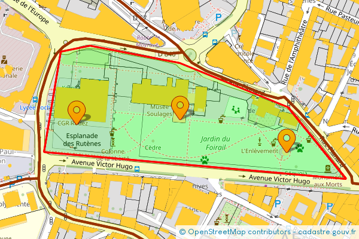

[](https://packagist.org/packages/DantSu/php-french-cadastral-map-static-api)
[](https://packagist.org/packages/DantSu/php-french-cadastral-map-static-api)
[](https://github.com/DantSu/php-french-cadastral-map-static-api/blob/master/LICENSE)

# PHP French Cadastral Map Static API

PHP library to easily get static image from French Cadastral Government map with markers, lines, polygons and circles.

Map source : [cadastre.gouv.fr](https://www.cadastre.gouv.fr/)

# API PHP de Carte Statique du Cadastre Français

Librairie PHP permettant d'extraire facilement des images de la carte du cadastre Français avec des markers, des lignes, polygones and cercles. 

Source de la carte : [cadastre.gouv.fr](https://www.cadastre.gouv.fr/)

## ✨ Supporting

⭐ Star this repository to support this project. You will contribute to increase the visibility of this library 🙂

## Installation

Install this library easily with composer :

```cmd
composer require dantsu/french-cadastral-map-static-api
```

## How to use

Generate French Cadastral map static image with marker and line :

```php
use \DantSu\OpenStreetMapStaticAPI\OpenStreetMap;
use \DantSu\FrenchCadastralMapStaticAPI\FrenchCadastralTileLayer;
use \DantSu\OpenStreetMapStaticAPI\LatLng;
use \DantSu\OpenStreetMapStaticAPI\Polygon;
use \DantSu\OpenStreetMapStaticAPI\Markers;

\header('Content-type: image/png');
(new OpenStreetMap(new LatLng(44.351933, 2.568113), 17, 600, 400))
    ->addLayer(
        new FrenchCadastralTileLayer(
            12202,
            [
                FrenchCadastralTileLayer::LAYER_AMORCES_CAD,
                FrenchCadastralTileLayer::LAYER_CADASTRAL_PARCEL,
                FrenchCadastralTileLayer::LAYER_SUBFISCAL,
                // CadastralTileLayer::LAYER_CLOTURE,
                FrenchCadastralTileLayer::LAYER_DETAIL_TOPO,
                FrenchCadastralTileLayer::LAYER_HYDRO,
                FrenchCadastralTileLayer::LAYER_BUILDING,
                FrenchCadastralTileLayer::LAYER_BORNE_REPERE,
                // CadastralTileLayer::LAYER_VOIE_COMMUNICATION,
                // CadastralTileLayer::LAYER_LIEUDIT
            ]
        )
    )
    ->addMarkers(
        (new Markers(__DIR__ . '/resources/marker.png'))
            ->setAnchor(Markers::ANCHOR_CENTER, Markers::ANCHOR_BOTTOM)
            ->addMarker(new LatLng(44.351933, 2.568113))
            ->addMarker(new LatLng(44.351510, 2.570020))
            ->addMarker(new LatLng(44.351873, 2.566250))
    )
    ->addDraw(
        (new Polygon('FF0000', 2, '00FF00CC'))
            ->addPoint(new LatLng(44.351172, 2.571092))
            ->addPoint(new LatLng(44.352097, 2.570045))
            ->addPoint(new LatLng(44.352665, 2.568107))
            ->addPoint(new LatLng(44.352887, 2.566503))
            ->addPoint(new LatLng(44.352806, 2.565972))
            ->addPoint(new LatLng(44.351517, 2.565672))
    )
    ->getImage()
    ->displayPNG();
```



## Documentation

| Class | Description |
|---    |---          |
| [FrenchCadastralTileLayer](./classes/DantSu/FrenchCadastralMapStaticAPI/FrenchCadastralTileLayer.md) | DantSu\FrenchCadastralMapStaticAPI\FrenchCadastralTileLayer define french cadastral tile server and related configuration|

For more documentation, see [DantSu/php-osm-static-api](https://github.com/DantSu/php-osm-static-api)

## Contributing

Please fork this repository and contribute back using pull requests.

Any contributions, large or small, major features, bug fixes, are welcomed and appreciated but will be thoroughly reviewed.

