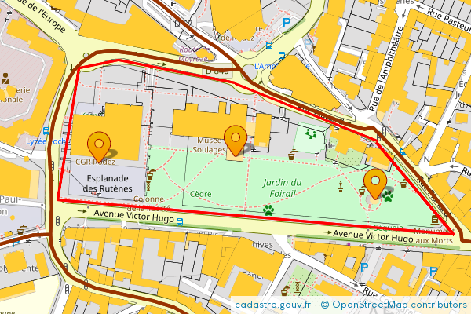

[](https://packagist.org/packages/DantSu/php-french-cadastral-map-static-api)
[](https://packagist.org/packages/DantSu/php-french-cadastral-map-static-api)
[](https://github.com/DantSu/php-french-cadastral-map-static-api/blob/master/LICENSE)

# PHP French Cadastral Map Static API

PHP library to easily get static image from French Cadastral Government map with markers and lines.

Map source : [cadastre.gouv.fr](https://www.cadastre.gouv.fr/)

# API PHP de Carte Statique du Cadastre Français

Librairie PHP permettant d'extraire facilement des images de la carte du cadastre Français avec des markers et des tracés. 

Source de la carte : [cadastre.gouv.fr](https://www.cadastre.gouv.fr/)

## ✨ Supporting

⭐ Star this repository to support this project. You will contribute to increase the visibility of this library 🙂

## Installation

Install this library easily with composer :

```cmd
composer require dantsu/french-cadastral-map-static-api
```

## How to use

Generate French Cadastral map static image with marker and line :

```php
use \DantSu\FrenchCadastralMapStaticAPI\FrenchCadastralMap;
use \DantSu\FrenchCadastralMapStaticAPI\LatLng;
use \DantSu\FrenchCadastralMapStaticAPI\Line;
use \DantSu\FrenchCadastralMapStaticAPI\Markers;

\header('Content-type: image/png');
(new FrenchCadastralMap(12202, new LatLng(44.351933, 2.568113), 17, 600, 400))
    ->setLayers([
        FrenchCadastralMap::LAYER_AMORCES_CAD,
        FrenchCadastralMap::LAYER_CADASTRAL_PARCEL,
        FrenchCadastralMap::LAYER_SUBFISCAL,
        // FrenchCadastralMap::LAYER_CLOTURE,
        FrenchCadastralMap::LAYER_DETAIL_TOPO,
        FrenchCadastralMap::LAYER_HYDRO,
        FrenchCadastralMap::LAYER_BUILDING,
        FrenchCadastralMap::LAYER_BORNE_REPERE,
        // FrenchCadastralMap::LAYER_VOIE_COMMUNICATION,
        // FrenchCadastralMap::LAYER_LIEUDIT
    ])
    ->setDisplayOpenStreetMap(true)
    ->addMarkers(
        (new Markers(__DIR__ . '/resources/marker.png'))
            ->setAnchor(Markers::ANCHOR_CENTER, Markers::ANCHOR_BOTTOM)
            ->addMarker(new LatLng(44.351933, 2.568113))
            ->addMarker(new LatLng(44.351510, 2.570020))
            ->addMarker(new LatLng(44.351873, 2.566250))
    )
    ->addLine(
        (new Line('FF0000', 2))
            ->addPoint(new LatLng(44.351172, 2.571092))
            ->addPoint(new LatLng(44.352097, 2.570045))
            ->addPoint(new LatLng(44.352665, 2.568107))
            ->addPoint(new LatLng(44.352887, 2.566503))
            ->addPoint(new LatLng(44.352806, 2.565972))
            ->addPoint(new LatLng(44.351517, 2.565672))
            ->addPoint(new LatLng(44.351172, 2.571092))
    )
    ->getImage()
    ->displayPNG();
```



## Documentation

| Class | Description |
|---    |---          |
| [FrenchCadastralMap](./docs/classes/DantSu/FrenchCadastralMapStaticAPI/FrenchCadastralMap.md) | DantSu\FrenchCadastralMapStaticAPI\FrenchCadastralMap is a PHP library created for easily get static image from French Cadastral Government map with markers and lines.|
| [LatLng](./docs/classes/DantSu/FrenchCadastralMapStaticAPI/LatLng.md) | DantSu\FrenchCadastralMapStaticAPI\LatLng define latitude and longitude for map, lines, markers.|
| [Line](./docs/classes/DantSu/FrenchCadastralMapStaticAPI/Line.md) | DantSu\FrenchCadastralMapStaticAPI\Line draw line on the map.|
| [Markers](./docs/classes/DantSu/FrenchCadastralMapStaticAPI/Markers.md) | DantSu\FrenchCadastralMapStaticAPI\Markers display markers on the map.|
| [XY](./docs/classes/DantSu/FrenchCadastralMapStaticAPI/XY.md) | DantSu\FrenchCadastralMapStaticAPI\XY define X and Y pixel position for map, lines, markers.|

## Contributing

Please fork this repository and contribute back using pull requests.

Any contributions, large or small, major features, bug fixes, are welcomed and appreciated but will be thoroughly reviewed.

